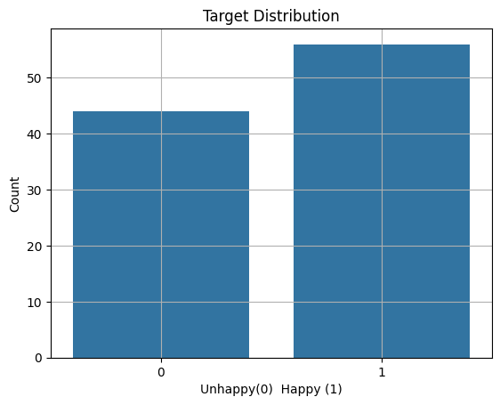
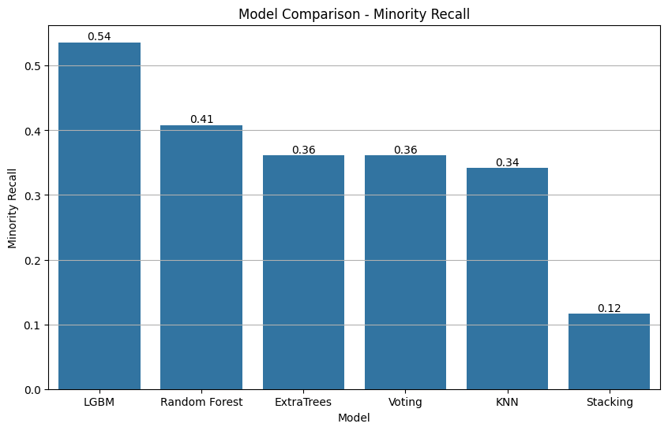

# Happy Customers

---

## Business Background
A customer satisfaction survey was provided by a fast-growing logistics and delivery company.  They work with several partners to deliver on-demand orders to their customers. Customer happiness is one of their key business measures, as a start-up with a strategic plan of global expansion.

## Goal

The main focus was to identify which factors affected most for the unhappiness of the customers.

## Objectives

The objectives of this work were:

- A model was trained to improve identification of unhappy customers  
- The required accuracy benchmark of 73% was targeted  
- The most important survey questions were identified  
- Low-value questions were tested for removal in future surveys  

---

## The Dataset

Customer feedback was collected from a selected **unbiased** cohort using a short survey of six questions. Each question was rated from 1 to 5, where higher values showed stronger agreement. Customer happiness was recorded as a binary outcome: unhappy or happy.

### Data Description
- **Y**: target label, where **0 = unhappy** and **1 = happy**
- **X1**: Order delivered on time  
- **X2**: Contents of the order was as expected  
- **X3**: Ordered everything that was wanted  
- **X4**: Paid a good price for the order  
- **X5**: Satisfied with courier  
- **X6**: The app made ordering easy

---

## Method

The following steps were carried out:

- The dataset was checked for shape, types, missing values, and class balance.
- The data was split into training and testing sets using an **80/20 split** 
- Exploratory plots were produced using **training data** only to reduce leakage risk. The plots explain how each feature behaves with target.
- A wide set of classifiers was screened using **LazyPredict** to get a fast baseline view  
- Special attention was given to identifying unhappy customers using minority-class recall
- Four candidate models were selected from Lazy Classifier higest minority_recall and re-evaluated using cross-validation for a fairer comparison  
- Those models include Random Forest, Extra Trees, Voting, with two ensemble methods stacking and voting were compared with cross vaodation approch. 
- Hyperparameter tuning was performed for LightGBM using Hyperopt (TPE search)  
- Feature importance and model-based feature selection were applied

After testing on few random seeds, all experiments were run with a fixed random seed to ensure reproducibility. 

**Selected random seed is 7964**

## Key Results

### Dataset Summary
- Rows: **126**
- Features: **6 survey questions**
- Target classes: **nearly balanced**

### Baseline Model Screening (LazyPredict)
LazyPredict was used as an initial screening step. It was treated as a quick baseline because it evaluated models using a single train/test split.

The table below shows selected models from the LazyClassifier output, ranked by minority-class recall.

| Model                | F1 Score | Minority Recall |
|----------------------|----------|-----------------|
| ExtraTreesClassifier | 0.68     | 0.85            |
| LGBMClassifier       | 0.73     | 0.77            |
| RandomForest         | 0.68     | 0.69            |
| KNeighborsClassifier | 0.61     | 0.69            |

Key observation:
- Extra Trees achieved the highest minority recall of 0.85 for unhappy customers in this initial run. This means that approximately 85% of unhappy customers in the evaluated data split were correctly identified by the Extra Trees model.

Following is th eresult of the LazyClassifier.

### Cross-Validated Comparison (Fair Model Comparison)
Cross-validation was used to compare selected models more reliably. 5 fold cross validation was used as 

Models compared:
- LightGBM
- Random Forest
- Extra Trees
- KNN
- Voting (soft)
- Stacking

Best cross-validated minority recall was achieved by:
- **LightGBM (after tuning)**

  The ensempble results do not provide bette r accuracy they are highlt affected withe selected types of model, specifically 3 out 4 models select for the ensempbling are tree based models. If the approch was with several architectures such treebased, distance based, gradient boosting based then ensembling have a better generatlisation of different techniques when irt comes to modelin g the data.

### Hyperpatrameter tuning fro hyperopt

- The final tuned LightGBM model achieved balanced and interpretable results on unseen test data

### Tuned LightGBM Performance (Test Set)
The tuned LightGBM model was evaluated on the held-out test set.

|         | precision | recall | f1-score | support|
|---------|-----------|--------|----------|--------|
| 0       | 0.62      | 0.77   |  0.69    |   13   |
| 1       | 0.70      | 0.54   |  0.61    |   13   |
| accuracy|           |        |  0.65    |   26   |

- Test accuracy: **0.65**
- Unhappy class recall (Y=0): **0.77**

This showed that unhappy customers were captured more reliably than happy customers, which matched the main objective.

### Feature Importance Findings

Feature importance analysis from LightGBM showed what influenced customer happiness:

Most influential questions were:

1. **X5: Satisfaction with courier**
2. **X4: Paid a good price for the order**

Less influential questions were related to app usability and ordering completeness.

### Survey Optimisation Recommendation

Based on feature selection results, the following questions were identified as removable with minimal impact of predictive value:

- The app makes ordering easy  
- Contents of the order was as expected  
- Order delivered on time  
- Ordered everything wanted to order  

This suggested that future surveys could be shortened while preserving predictive value.

---

## Business Recommendations

From a business perspective, the following recommendations can be made:

Courier and paying good price for the order are the leading indicators for unhappiness. If you pay more attention for those future surveys can include more questions related to those two areas while eliminating the other four questions.

For future surveys:
- More targeted questions around courier experience and pricing fairness can be added  
- Lower-value questions can be removed to reduce survey effort

---
## Repository Contents

- `data/ACME-HappinessSurvey2020.csv`  
  Source dataset used in this project.

- `src/`  
  Core functions for data loading, splitting, model training, tuning, and feature selection.

- `figures/`  
  Saved plots from exploratory analysis and model comparison.

- `main.py` (or the main script you run)  
  End-to-end pipeline run: EDA → model screening → cross-validation → tuning → feature selection.

---

## How to Run

1. Install dependencies  
2. Run the main script  
3. Outputs were saved under `figures/` and printed in the console  

